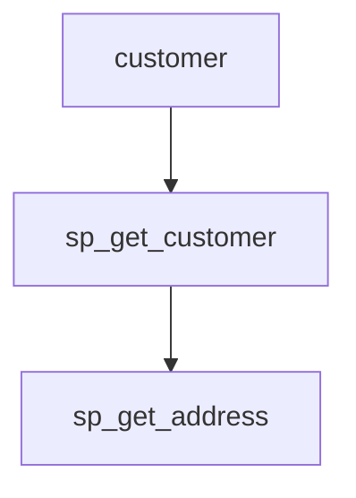

# 📄 Tool 4: Data Lineage Analyzer

## 🔍 What is Tool 4?

**Tool 4: Data Lineage Analyzer** is a Python-based utility designed to analyze and visualize data lineage in **Sybase** stored procedures. It identifies how data flows across procedures and tables, helping developers understand complex interdependencies within the database.

---

## ❓ Why Do We Need Tool 4?

* ✅ **Maintainability**: Track procedure interactions to avoid errors when modifying the database.
* ✅ **Impact Analysis**: Understand what will be affected when a table or procedure changes.
* ✅ **Compliance & Auditing**: Trace usage of sensitive data.
* ✅ **System Design**: Detect inefficient or redundant patterns in stored procedure logic.

---

## 📥 Inputs and 📤 Outputs

### ✅ Inputs

Tool 4 uses the outputs from Tool 1 and Tool 2.

**Tool 1 Output - `index.json`**

```json
{
  "sp_get_customer": {
    "params": ["@cust_id INT"],
    "calls": ["sp_get_address"],
    "tables": ["customer", "address"]
  }
}
```

**Tool 2 Output - `ast.json`**

```json
{
  "procedure": "sp_insert_order",
  "params": [...],
  "statements": [...],
  "variables": [...],
  "cursors": [...]
}
```

### ✅ Outputs

**Lineage JSON**:

```json
{
  "customer": ["sp_get_customer"],
  "sp_get_customer": ["sp_get_address"]
}
```

**Mermaid.js Diagram**:



These outputs provide both machine-readable data and visual representations to assist developers and analysts.

---

## ⚠️ Possible Errors and Handling

| Error               | Cause                               | Handling Strategy                    |
| ------------------- | ----------------------------------- | ------------------------------------ |
| `KeyError`          | Missing key in input JSON           | Use `.get()` with default values     |
| `FileNotFoundError` | File paths are incorrect or missing | Add path validation and user prompts |
| `SyntaxError`       | Malformed SQL in procedure          | Improve regex or parsing logic       |
| Circular Reference  | Recursive procedure calls           | Track visited nodes while traversing |

---

## 🧰 Libraries Used

| Library      | Purpose                                     |
| ------------ | ------------------------------------------- |
| `os`, `sys`  | File path and directory handling            |
| `json`       | Read/write structured data from tools       |
| `re`         | Regex parsing of stored procedures          |
| `unittest`   | Write and run test cases                    |
| `mermaid.js` | Visualize procedure and table relationships |

---

## 🤔 Why These Libraries?

* `os`, `sys`: Platform-independent file operations.
* `json`: Native support for lightweight data exchange.
* `re`: Efficient for parsing SQL-like syntax.
* `unittest`: Built-in testing tool in Python.
* `mermaid.js`: Markdown-friendly graph visualization.

---

## 🔄 Backup/Alternative Libraries

| Primary    | Alternatives           |
| ---------- | ---------------------- |
| `re`       | `sqlparse`, `antlr4`   |
| `json`     | `pickle`, `yaml`       |
| `unittest` | `pytest`               |
| `mermaid`  | `graphviz`, `plantuml` |

---

## 📁 Project Structure

```
DATA_LINEAGE_ANALYZER/
├── data/           → Raw or intermediate data files
├── diagrams/       → Output lineage diagrams (Mermaid or PNG)
├── src/            → Core Python code for parsing and lineage tracing
├── tests/          → Unit tests for each module
├── run_tool4.py    → Entrypoint script for running Tool 4
├── README.md       → This documentation
```

---

## ✅ Summary

Tool 4 takes structured metadata from previous tools and produces an easy-to-understand, exportable view of how data flows through a Sybase-based system. It's an essential component in large-scale enterprise database modernization and auditing.

---

> For contributions, enhancements, or bug fixes, please refer to the `README.md` or contact the internal tool engineering team.
