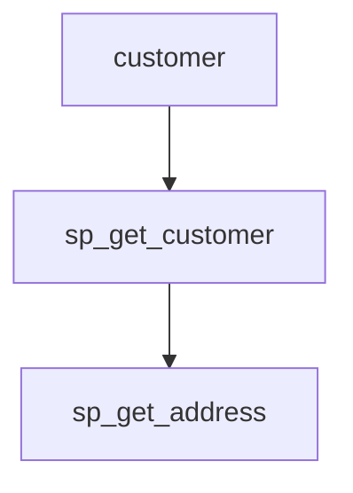

# 📄 Tool 4: Data Lineage Analyzer

## 🔍 What is Tool 4?

**Tool 4: Data Lineage ** is a Python-based utility designed to analyze and visualize data lineage in **Sybase** stored procedures. It identifies how data flows across procedures and tables, helping developers understand complex interdependencies within the database.

---

## ❓ Why Do We Need Tool 4?

* ✅ **Maintainability**: Track procedure interactions to avoid errors when modifying the database.
* ✅ **Impact Analysis**: Understand what will be affected when a table or procedure changes.
* ✅ **Compliance & Auditing**: Trace usage of sensitive data.
* ✅ **System Design**: Detect inefficient or redundant patterns in stored procedure logic.

---

## 📥 Inputs and 📤 Outputs

### ✅ Inputs

Tool 4 uses the outputs from Tool 1 and Tool 2.

**Tool 1 Output - `index.json`**

```json
{
  "sp_get_customer": {
    "params": ["@cust_id INT"],
    "calls": ["sp_get_address"],
    "tables": ["customer", "address"]
  }
}
```

**Tool 2 Output - `ast.json`**

```json
{
  "procedure": "sp_insert_order",
  "params": [...],
  "statements": [...],
  "variables": [...],
  "cursors": [...]
}
```

### ✅ Outputs

**Lineage JSON**:

```json
{
  "customer": ["sp_get_customer"],
  "sp_get_customer": ["sp_get_address"]
}
```

**Mermaid.js Diagram**:



These outputs provide both machine-readable data and visual representations to assist developers and analysts.

---


## ❓ What is a Mermaid Diagram?
Mermaid.js is a JavaScript-based diagramming and charting tool that uses a simple text syntax to define graphs. It allows users to write diagrams directly in Markdown and render them as flowcharts, sequence diagrams, Gantt charts, and more.

In this project, Mermaid diagrams are used to visualize data lineage, showing how data flows between tables and stored procedures in a Sybase database.

---
## 🤔 Why Do We Need Mermaid Diagrams?
Mermaid diagrams help in:

✅ Visualizing Data Flow: Clearly display relationships between procedures and tables.
✅ Debugging: Spot missing or unexpected relationships quickly.
✅ Documentation: Provide non-technical stakeholders with easy-to-read visuals.
✅ Impact Analysis: Understand what changes affect which procedures or tables.
✅ Auditing & Compliance: Trace sensitive data usage paths visually.

---

## ⚙️ Functionality

1.  **SQL Parsing:** Parses SQL scripts to identify stored procedures, table references, and relationships.
2.  **Data Extraction:** Extracts metadata, including procedure names, parameters, called procedures, and table usage.
3.  **Lineage Analysis:** Analyzes the extracted metadata to determine the data lineage, i.e., how data flows between procedures and tables.
4.  **Diagram Generation:** Generates Mermaid.js diagrams to visualize the data lineage.
5.  **Index Generation:** Creates a `generated_index.json` file that indexes procedures, calls, and tables.
6.  **Markdown Conversion:** Converts the Mermaid.js diagram to a Markdown file for easy integration into documentation.
7.  **Validation:** Validates the consistency between the AST and Index file.

---

## 🧰 Libraries Used

| Library      | Purpose                                     |
| ------------ | ------------------------------------------- |
| `os`, `sys`  | File path and directory handling            |
| `json`       | Read/write structured data from tools       |
| `unittest`   | Write and run test cases                    |
| `mermaid.js` | Visualize procedure and table relationships |

---

## 🤔 Why These Libraries?

* `os`, `sys`: Platform-independent file operations.
* `json`: Native support for lightweight data exchange.
* `re`: Efficient for parsing SQL-like syntax.
* `unittest`: Built-in testing tool in Python.
* `mermaid.js`: Markdown-friendly graph visualization.

---

## 🔄 Backup/Alternative Libraries

| Primary    | Alternatives           |
| ---------- | ---------------------- |
| `re`       | `sqlparse`, `antlr4`   |
| `json`     | `pickle`, `yaml`       |
| `unittest` | `pytest`               |
| `mermaid`  | `graphviz`, `plantuml` |

---

## 🗂️ File Structure

```
Data_Lineage_Analyzer/
├── data/
│   ├── ast.json                  # Output from Tool 2 (AST data)
│   ├── index.json                # Output from Tool 1 (Procedure index)
│   ├── lineage.json              # Output from Tool 4 (Data lineage)
│   └── generated_index.json      # Generated index from lineage + Mermaid
├── diagrams/
│   ├── lineage.mmd               # Mermaid diagram file
│   └── lineage.md                # Markdown file with Mermaid diagram
├── src/
│   ├── analyze_lineage.py        # Analyzes data lineage
│   ├── convert_mmd_to_md.py    # Converts Mermaid to Markdown
│   ├── generate_mermaid.py       # Generates Mermaid diagram
│   ├── lineage_to_index.py       # Generates index from lineage
│   ├── validation_script.py      # Validates AST and index.json
├── tool1/
│   ├── proc_indexer.py           # Indexes procedures in SQL scripts
│   ├── TSqlLexer.py              # Lexer for T-SQL
│   ├── TSqlParser.py             # Parser for T-SQL
├── run_tool4.py                # Main script to run the tool
├── test.sql                      # Sample SQL input file
├── logging_styles.py         # Styles for terminal output
└── README.md                   # Documentation
```

---

## 🚀 Usage

### Prerequisites

*   Python 3.x
*   ANTLR4 (for Tool 1)

### Installation

1.  Clone the repository:

    ```bash
    git clone <repository_url>
    cd Data_Lineage_Analyzer
    ```

2.  Install the required Python packages:

    ```bash
    pip install -r <required packages>
    ```

3.  Install ANTLR4 and generate the parser for Tool 1:

    *   Download ANTLR: [https://www.antlr.org/download.html](https://www.antlr.org/download.html)
    *   Set up ANTLR environment variables.
    *   Generate the parser using the following commands:

    ```bash
    antlr4 -Dlanguage=Python3 -visitor tool1/TSqlLexer.g4 tool1/TSqlParser.g4
    ```

---

### Running the Tool

1.  Prepare the input files:
    *   Ensure that `index.json` and `ast.json` are present in the `data/` directory. These files are outputs from Tool 1 and Tool 2, respectively.
    *   Create or modify the `test.sql` file with the SQL script you want to analyze.

2.  Run the `run_tool4.py` script:

    ```bash
    python run_tool4.py
    ```

3.  The script will:

    *   Validate `index.json` against `ast.json`.
    *   Analyze the data lineage and generate `lineage.json` using `analyze_lineage.py`.
    *   Generate a Mermaid diagram (`lineage.mmd`) and convert it to Markdown (`lineage.md`).
    *   It then runs `lineage_to_index.py` which generates `generated_index.json` file according to `indexSchema.json` which can be used for validation against the existing `index.json` .

### Output

The tool generates the following output files:

*   `data/lineage.json`: Contains the data lineage information in JSON format.
*   `diagrams/lineage.mmd`: Contains the Mermaid.js diagram code.
*   `diagrams/lineage.md`: Contains the Markdown file with the Mermaid.js diagram.
*   `data/generated_index.json`: Contains the generated index of procedures, calls, and tables.

---
## ⚠️ Possible Errors

  |       Error Type 	      |             	  Description                      |
  |-------------------------|--------------------------------------------------|
  | Node Collision          |	Nodes with same name but different types         |
  | Styling Ignored	        | Mermaid ignores classDef if nodes aren't defined |

---

## ⚠️ Possible Errors and Handling

| Error               | Cause                               | Handling Strategy                    |
| ------------------- | ----------------------------------- | ------------------------------------ |
| `KeyError`          | Missing key in input JSON           | Use `.get()` with default values     |
| `FileNotFoundError` | File paths are incorrect or missing | Add path validation and user prompts |
| `SyntaxError`       | Malformed SQL in procedure          | Improve regex or parsing logic       |
| Circular Reference  | Recursive procedure calls           | Track visited nodes while traversing |

---

## 🛠️ How We Handled It
  |       Problem  	        |             Solution                                  |
  |-------------------------|-------------------------------------------------------|
  | Missing files	          | Added default path logic and validation               |
  | Broken Mermaid syntax	  | Ensured all nodes are explicitly defined using [Label]|
  | Styling ignored	        | Applied class only after defining node labels         |
  | Node type identification|	Used naming conventions like table_ and proc_         |
  | Readability of nodes	  | Stripped prefixes in label rendering                  |

---

## ✅ Summary

Tool 4 takes structured metadata from previous tools and produces an easy-to-understand, exportable view of how data flows through a Sybase-based system. It also automates the generation of visual lineage diagrams using Mermaid.js from structured lineage data. It's an essential component in large-scale enterprise database modernization and auditing. It's a critical aid in understanding, debugging, and documenting stored procedure dependencies in complex Sybase-based systems.

---

> For contributions, enhancements, or bug fixes, please refer to the `README.md` or contact the internal tool engineering team(interns).


used pytest for testing
added type_mapping for tool 1
added conditionfor type mapping if type is not available in type mapping then the code wont proced further and ill print the error