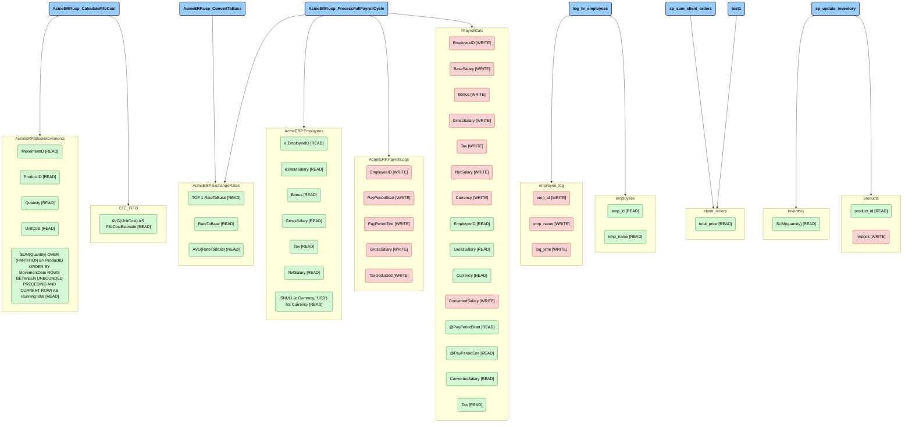

```mermaid
graph TD
    %% Node styles
    classDef table fill:#f96,stroke:#333,stroke-width:2px,color:#000,font-weight:bold;
    classDef stored_proc fill:#9cf,stroke:#333,stroke-width:2px,color:#000,font-weight:bold;
    classDef read_col fill:#d3f8d3,stroke:#2b802b,stroke-width:1px,color:#000;
    classDef write_col fill:#f8d3d3,stroke:#c23b22,stroke-width:1px,color:#000;
    classDef default_col fill:#fff,stroke:#333,stroke-width:1px,color:#000,font-style:italic;


    subgraph AcmeERP_Employees["AcmeERP.Employees"]
        AcmeERP_Employees_e_EmployeeID_read("e.EmployeeID [READ]");
        class AcmeERP_Employees_e_EmployeeID_read read_col;
        AcmeERP_Employees_e_BaseSalary_read("e.BaseSalary [READ]");
        class AcmeERP_Employees_e_BaseSalary_read read_col;
        AcmeERP_Employees_Bonus_read("Bonus [READ]");
        class AcmeERP_Employees_Bonus_read read_col;
        AcmeERP_Employees_GrossSalary_read("GrossSalary [READ]");
        class AcmeERP_Employees_GrossSalary_read read_col;
        AcmeERP_Employees_Tax_read("Tax [READ]");
        class AcmeERP_Employees_Tax_read read_col;
        AcmeERP_Employees_NetSalary_read("NetSalary [READ]");
        class AcmeERP_Employees_NetSalary_read read_col;
        AcmeERP_Employees_ISNULL_e_Currency_USD_AS_Currency_read("ISNULL(e.Currency, 'USD') AS Currency [READ]");
        class AcmeERP_Employees_ISNULL_e_Currency_USD_AS_Currency_read read_col;
    end

    subgraph AcmeERP_ExchangeRates["AcmeERP.ExchangeRates"]
        AcmeERP_ExchangeRates_TOP_1_RateToBase_read("TOP 1 RateToBase [READ]");
        class AcmeERP_ExchangeRates_TOP_1_RateToBase_read read_col;
        AcmeERP_ExchangeRates_RateToBase_read("RateToBase [READ]");
        class AcmeERP_ExchangeRates_RateToBase_read read_col;
        AcmeERP_ExchangeRates_TOP_1_RateToBase_read("TOP 1 RateToBase [READ]");
        class AcmeERP_ExchangeRates_TOP_1_RateToBase_read read_col;
        AcmeERP_ExchangeRates_AVG_RateToBase__read("AVG(RateToBase) [READ]");
        class AcmeERP_ExchangeRates_AVG_RateToBase__read read_col;
    end

    subgraph AcmeERP_PayrollLogs["AcmeERP.PayrollLogs"]
        AcmeERP_PayrollLogs_EmployeeID_write("EmployeeID [WRITE]");
        class AcmeERP_PayrollLogs_EmployeeID_write write_col;
        AcmeERP_PayrollLogs_PayPeriodStart_write("PayPeriodStart [WRITE]");
        class AcmeERP_PayrollLogs_PayPeriodStart_write write_col;
        AcmeERP_PayrollLogs_PayPeriodEnd_write("PayPeriodEnd [WRITE]");
        class AcmeERP_PayrollLogs_PayPeriodEnd_write write_col;
        AcmeERP_PayrollLogs_GrossSalary_write("GrossSalary [WRITE]");
        class AcmeERP_PayrollLogs_GrossSalary_write write_col;
        AcmeERP_PayrollLogs_TaxDeducted_write("TaxDeducted [WRITE]");
        class AcmeERP_PayrollLogs_TaxDeducted_write write_col;
    end

    subgraph AcmeERP_StockMovements["AcmeERP.StockMovements"]
        AcmeERP_StockMovements_MovementID_read("MovementID [READ]");
        class AcmeERP_StockMovements_MovementID_read read_col;
        AcmeERP_StockMovements_ProductID_read("ProductID [READ]");
        class AcmeERP_StockMovements_ProductID_read read_col;
        AcmeERP_StockMovements_Quantity_read("Quantity [READ]");
        class AcmeERP_StockMovements_Quantity_read read_col;
        AcmeERP_StockMovements_UnitCost_read("UnitCost [READ]");
        class AcmeERP_StockMovements_UnitCost_read read_col;
        AcmeERP_StockMovements_SUM_Quantity_OVER_PARTITION_BY_ProductID_ORDER_BY_MovementDate_ROWS_BETWEEN_UNBOUNDED_PRECEDING_AND_CURRENT_ROW_AS_RunningTotal_read("SUM(Quantity) OVER (PARTITION BY ProductID ORDER BY MovementDate ROWS BETWEEN UNBOUNDED PRECEDING AND CURRENT ROW) AS RunningTotal [READ]");
        class AcmeERP_StockMovements_SUM_Quantity_OVER_PARTITION_BY_ProductID_ORDER_BY_MovementDate_ROWS_BETWEEN_UNBOUNDED_PRECEDING_AND_CURRENT_ROW_AS_RunningTotal_read read_col;
    end

    subgraph CTE_FIFO["CTE_FIFO"]
        CTE_FIFO_AVG_UnitCost_AS_FifoCostEstimate_read("AVG(UnitCost) AS FifoCostEstimate [READ]");
        class CTE_FIFO_AVG_UnitCost_AS_FifoCostEstimate_read read_col;
    end

    subgraph _PayrollCalc["#PayrollCalc"]
        _PayrollCalc_EmployeeID_write("EmployeeID [WRITE]");
        class _PayrollCalc_EmployeeID_write write_col;
        _PayrollCalc_BaseSalary_write("BaseSalary [WRITE]");
        class _PayrollCalc_BaseSalary_write write_col;
        _PayrollCalc_Bonus_write("Bonus [WRITE]");
        class _PayrollCalc_Bonus_write write_col;
        _PayrollCalc_GrossSalary_write("GrossSalary [WRITE]");
        class _PayrollCalc_GrossSalary_write write_col;
        _PayrollCalc_Tax_write("Tax [WRITE]");
        class _PayrollCalc_Tax_write write_col;
        _PayrollCalc_NetSalary_write("NetSalary [WRITE]");
        class _PayrollCalc_NetSalary_write write_col;
        _PayrollCalc_Currency_write("Currency [WRITE]");
        class _PayrollCalc_Currency_write write_col;
        _PayrollCalc_EmployeeID_read("EmployeeID [READ]");
        class _PayrollCalc_EmployeeID_read read_col;
        _PayrollCalc_GrossSalary_read("GrossSalary [READ]");
        class _PayrollCalc_GrossSalary_read read_col;
        _PayrollCalc_Currency_read("Currency [READ]");
        class _PayrollCalc_Currency_read read_col;
        _PayrollCalc_ConvertedSalary_write("ConvertedSalary [WRITE]");
        class _PayrollCalc_ConvertedSalary_write write_col;
        _PayrollCalc__PayPeriodStart_read("@PayPeriodStart [READ]");
        class _PayrollCalc__PayPeriodStart_read read_col;
        _PayrollCalc__PayPeriodEnd_read("@PayPeriodEnd [READ]");
        class _PayrollCalc__PayPeriodEnd_read read_col;
        _PayrollCalc_ConvertedSalary_read("ConvertedSalary [READ]");
        class _PayrollCalc_ConvertedSalary_read read_col;
        _PayrollCalc_Tax_read("Tax [READ]");
        class _PayrollCalc_Tax_read read_col;
    end

    subgraph client_orders["client_orders"]
        client_orders_total_price_read("total_price [READ]");
        class client_orders_total_price_read read_col;
        client_orders_total_price_read("total_price [READ]");
        class client_orders_total_price_read read_col;
    end

    subgraph employee_log["employee_log"]
        employee_log_emp_id_write("emp_id [WRITE]");
        class employee_log_emp_id_write write_col;
        employee_log_emp_name_write("emp_name [WRITE]");
        class employee_log_emp_name_write write_col;
        employee_log_log_time_write("log_time [WRITE]");
        class employee_log_log_time_write write_col;
    end

    subgraph employees["employees"]
        employees_emp_id_read("emp_id [READ]");
        class employees_emp_id_read read_col;
        employees_emp_name_read("emp_name [READ]");
        class employees_emp_name_read read_col;
    end

    subgraph inventory["inventory"]
        inventory_SUM_quantity__read("SUM(quantity) [READ]");
        class inventory_SUM_quantity__read read_col;
    end

    subgraph products["products"]
        products_product_id_read("product_id [READ]");
        class products_product_id_read read_col;
        products_restock_write("restock [WRITE]");
        class products_restock_write write_col;
    end
    AcmeERP_usp_CalculateFifoCost("AcmeERP.usp_CalculateFifoCost");
    class AcmeERP_usp_CalculateFifoCost stored_proc;
    AcmeERP_usp_ConvertToBase("AcmeERP.usp_ConvertToBase");
    class AcmeERP_usp_ConvertToBase stored_proc;
    AcmeERP_usp_ProcessFullPayrollCycle("AcmeERP.usp_ProcessFullPayrollCycle");
    class AcmeERP_usp_ProcessFullPayrollCycle stored_proc;
    log_hr_employees("log_hr_employees");
    class log_hr_employees stored_proc;
    sp_sum_client_orders("sp_sum_client_orders");
    class sp_sum_client_orders stored_proc;
    sp_update_inventory("sp_update_inventory");
    class sp_update_inventory stored_proc;
    test1("test1");
    class test1 stored_proc;

    %% Relationships
    AcmeERP_usp_CalculateFifoCost --> AcmeERP_StockMovements;
    AcmeERP_usp_CalculateFifoCost --> CTE_FIFO;
    AcmeERP_usp_ConvertToBase --> AcmeERP_ExchangeRates;
    AcmeERP_usp_ProcessFullPayrollCycle --> AcmeERP_Employees;
    AcmeERP_usp_ProcessFullPayrollCycle --> AcmeERP_ExchangeRates;
    AcmeERP_usp_ProcessFullPayrollCycle --> AcmeERP_PayrollLogs;
    AcmeERP_usp_ProcessFullPayrollCycle --> _PayrollCalc;
    log_hr_employees --> employee_log;
    log_hr_employees --> employees;
    sp_sum_client_orders --> client_orders;
    sp_update_inventory --> inventory;
    sp_update_inventory --> products;
    test1 --> client_orders;
```