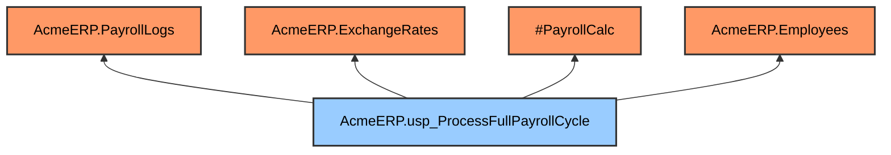

```mermaid
graph BT
    %% Node styles
    classDef table fill:#f96,stroke:#333,stroke-width:2px,color:#000;
    classDef stored_proc fill:#9cf,stroke:#333,stroke-width:2px ,color:#000;
    AcmeERP.usp_ProcessFullPayrollCycle --> AcmeERP.PayrollLogs
    AcmeERP.usp_ProcessFullPayrollCycle --> AcmeERP.ExchangeRates
    AcmeERP.usp_ProcessFullPayrollCycle --> #PayrollCalc
    AcmeERP.usp_ProcessFullPayrollCycle --> AcmeERP.Employees
    class AcmeERP.ExchangeRates,AcmeERP.PayrollLogs,#PayrollCalc,AcmeERP.Employees table;
    class AcmeERP.usp_ProcessFullPayrollCycle stored_proc;
```