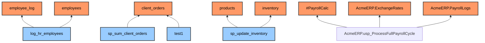

```mermaid
graph BT
    %% Node styles
    classDef table fill:#f96,stroke:#333,stroke-width:2px,color:#000;
    classDef stored_proc fill:#9cf,stroke:#333,stroke-width:2px ,color:#000;
    log_hr_employees --> employee_log
    log_hr_employees --> employees
    sp_sum_client_orders --> client_orders
    test1 --> client_orders
    sp_update_inventory --> products
    sp_update_inventory --> inventory
    AcmeERP.usp_ProcessFullPayrollCycle --> #PayrollCalc
    AcmeERP.usp_ProcessFullPayrollCycle --> AcmeERP.ExchangeRates
    AcmeERP.usp_ProcessFullPayrollCycle --> AcmeERP.PayrollLogs
    class #PayrollCalc,AcmeERP.PayrollLogs,employees,AcmeERP.ExchangeRates,employee_log,products,inventory,client_orders table;
    class sp_update_inventory,test1,log_hr_employees,sp_sum_client_orders stored_proc;
```