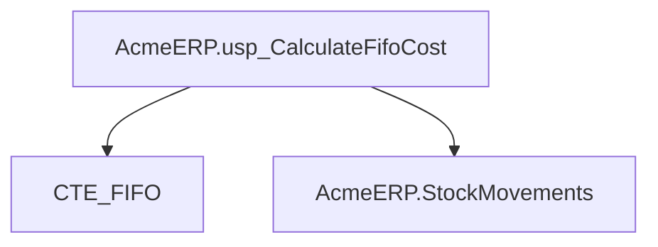
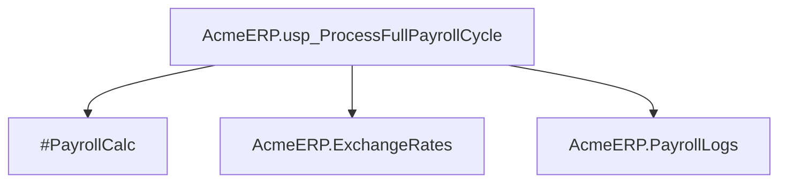
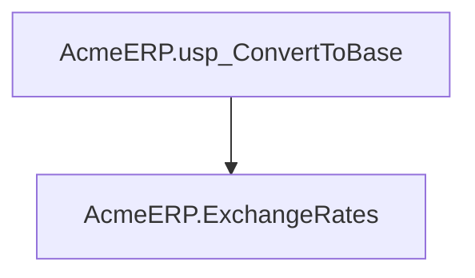
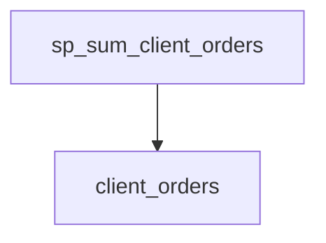
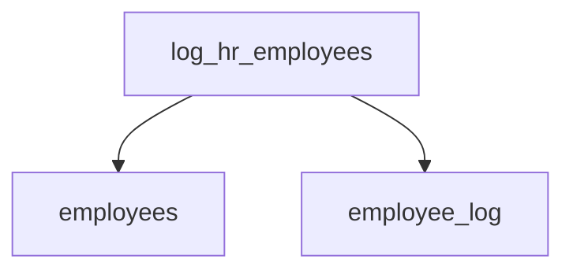
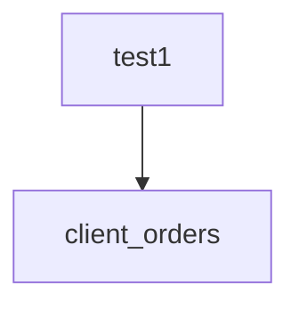
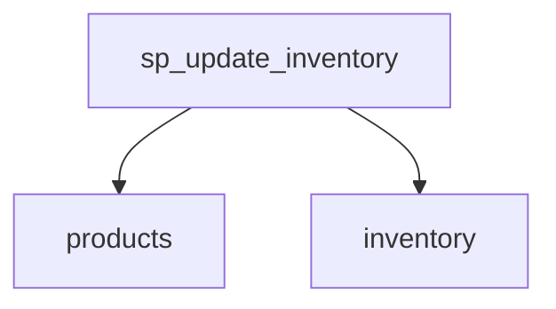

# Summary

- **Total Procedures**: 7
- **Total Tables**: 10
- **Most Called Procedure**: `N/A`

---

# Table of Contents

- [AcmeERP.usp_CalculateFifoCost](#acmeerpusp_calculatefifocost)
- [AcmeERP.usp_ProcessFullPayrollCycle](#acmeerpusp_processfullpayrollcycle)
- [AcmeERP.usp_ConvertToBase](#acmeerpusp_converttobase)
- [sp_sum_client_orders](#sp_sum_client_orders)
- [log_hr_employees](#log_hr_employees)
- [test1](#test1)
- [sp_update_inventory](#sp_update_inventory)

---

## Stored Procedure: AcmeERP.usp_CalculateFifoCost

---

### Parameters

| Name | Type |
|------|------|
| @ProductID | INTEGER |
| @QuantityRequested | INTEGER |

---

### Tables

- CTE_FIFO
- AcmeERP.StockMovements

---

### Called Procedures

---

### Call Graph

---

### Business Logic

The `AcmeERP.usp_CalculateFifoCost` stored procedure calculates the cost of goods sold (COGS) for a given product using the First-In, First-Out (FIFO) inventory costing method.  It takes the product ID (`@@ProductID`) and the quantity requested (`@@QuantityRequested`) as input.  The procedure processes inventory transactions from the `AcmeERP.StockMovements` table, likely using a common table expression (`CTE_FIFO`) to efficiently determine the cost of the oldest units first, to satisfy the requested quantity. The output (not explicitly shown in the provided code) presumably represents the total cost associated with the requested quantity of the specified product based on the FIFO inventory valuation method.

---

## Stored Procedure: AcmeERP.usp_ProcessFullPayrollCycle

---

### Parameters

| Name | Type |
|------|------|
| @PayPeriodStart | DATE |
| @PayPeriodEnd | DATE |

---

### Tables

- #PayrollCalc
- AcmeERP.ExchangeRates
- AcmeERP.PayrollLogs

---

### Called Procedures

---

### Call Graph

---

### Business Logic

The `AcmeERP.usp_ProcessFullPayrollCycle` stored procedure automates the complete payroll processing for a given pay period, defined by the `@@PayPeriodStart` and `@@PayPeriodEnd` parameters.  It calculates employee compensation, likely incorporating currency exchange rates from the `AcmeERP.ExchangeRates` table into the temporary `#PayrollCalc` table. Finally, it logs all payroll processing activity, including potentially calculated compensation and any errors encountered, within the `AcmeERP.PayrollLogs` table.  The procedure ensures accurate and auditable payroll calculations across a specified pay period.

---

## Stored Procedure: AcmeERP.usp_ConvertToBase

---

### Parameters

| Name | Type |
|------|------|
| @CurrencyCode | CHAR |
| @Amount | NUMERIC |
| @ConversionDate | DATE |

---

### Tables

- AcmeERP.ExchangeRates

---

### Called Procedures

---

### Call Graph

---

### Business Logic

The `AcmeERP.usp_ConvertToBase` stored procedure converts a given monetary amount from a specified currency into the base currency of the Acme ERP system.  It uses the `AcmeERP.ExchangeRates` table to retrieve the appropriate exchange rate for the given currency code and conversion date. The procedure takes the currency code (`@@CurrencyCode`), the amount to be converted (`@@Amount`), and the conversion date (`@@ConversionDate`) as input parameters and returns the equivalent amount in the base currency.  This allows for consistent reporting and financial analysis across different currencies within the Acme ERP system.

---

## Stored Procedure: sp_sum_client_orders

---

### Parameters

| Name | Type |
|------|------|
| @client_id | INTEGER |
| @from_date | DATE |
| @to_date | DATE |

---

### Tables

- client_orders

---

### Called Procedures

---

### Call Graph

---

### Business Logic

The stored procedure `sp_sum_client_orders` calculates the total value of orders for a specified client within a given date range, applying a 5% discount to orders exceeding $750.  It retrieves individual order totals from the `client_orders` table for the designated client and date range.  For each order exceeding the $750 threshold, the discounted amount (95% of the total) is accumulated into a grand total, which represents the final discounted sum of all qualifying client orders during the specified period.

---

## Stored Procedure: log_hr_employees

---

### Parameters

| Name | Type |
|------|------|

---

### Tables

- employees
- employee_log

---

### Called Procedures

---

### Call Graph

---

### Business Logic

The stored procedure `log_hr_employees` automatically logs all employees from the 'HR' department into the `employee_log` table.  For each HR employee, it records their employee ID and name, along with the current timestamp. This provides an audit trail of all HR personnel, potentially useful for security, reporting, or other HR-related tracking needs. The procedure uses a cursor to iterate through the HR employees in the `employees` table, ensuring each is individually logged.

---

## Stored Procedure: test1

---

### Parameters

| Name | Type |
|------|------|
| @client_id | INTEGER |
| @from_date | DATE |
| @to_date | DATE |

---

### Tables

- client_orders

---

### Called Procedures

---

### Call Graph

---

### Business Logic

Procedure `test1` calculates the total revenue for a given client (`@client_id`) within a specified date range (`@from_date` to `@to_date`).  It iterates through the client's orders in the `client_orders` table. For each order exceeding $750, a 5% discount is applied before adding its price to the grand total; otherwise, the full order price is added.  The final `@grand_total` represents the total revenue considering these potential discounts.

---

## Stored Procedure: sp_update_inventory

---

### Parameters

| Name | Type |
|------|------|

---

### Tables

- products
- inventory

---

### Called Procedures

---

### Call Graph

---

### Business Logic

The stored procedure `sp_update_inventory` automatically flags products requiring restocking.  It iterates through each active product (discontinued = 0) in the `products` table, summing its current inventory quantity from the `inventory` table. If the total quantity for a product falls below 10 units, the procedure sets the `restock` flag to 1 in the `products` table, indicating a need for replenishment.  This facilitates proactive inventory management by automatically identifying low-stock items.

---

