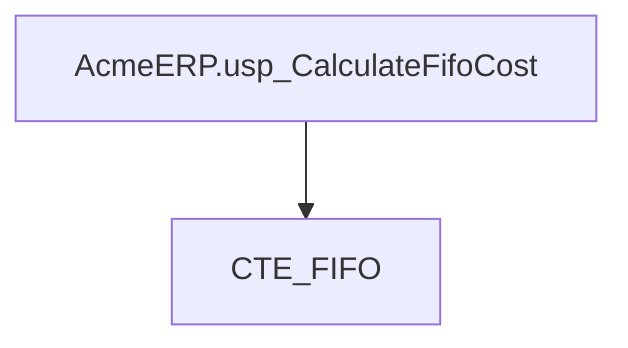
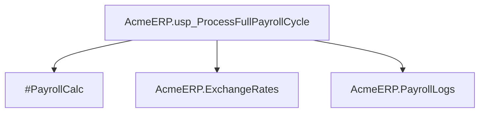
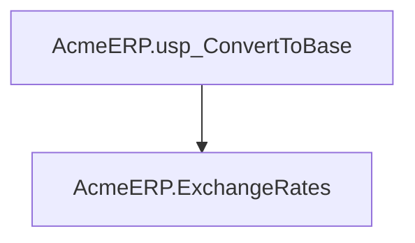

# Summary

- **Total Procedures**: 3
- **Total Tables**: 4
- **Most Called Procedure**: `N/A`

---

# Table of Contents

- [AcmeERP.usp_CalculateFifoCost](#acmeerpusp_calculatefifocost)
- [AcmeERP.usp_ProcessFullPayrollCycle](#acmeerpusp_processfullpayrollcycle)
- [AcmeERP.usp_ConvertToBase](#acmeerpusp_converttobase)

---

## Stored Procedure: AcmeERP.usp_CalculateFifoCost

---

### Parameters

| Name | Type |
|------|------|
| @ProductID | INTEGER |
| @QuantityRequested | INTEGER |

---

### Tables

- CTE_FIFO

---

### Called Procedures

---

### Call Graph

---

### Business Logic

The AcmeERP.usp_CalculateFifoCost stored procedure calculates the cost of goods sold (COGS) for a given product using the First-In, First-Out (FIFO) inventory costing method.  It takes the product ID (@@ProductID) and the quantity requested (@@QuantityRequested) as input and uses a common table expression (CTE) named CTE_FIFO, presumably containing inventory data with cost information, to determine the cost of the requested quantity based on the FIFO principle.  The procedure implicitly returns the total cost of the @@QuantityRequested units of @@ProductID, reflecting the cost of the oldest inventory items first.

---

## Stored Procedure: AcmeERP.usp_ProcessFullPayrollCycle

---

### Parameters

| Name | Type |
|------|------|
| @PayPeriodStart | DATE |
| @PayPeriodEnd | DATE |

---

### Tables

- #PayrollCalc
- AcmeERP.ExchangeRates
- AcmeERP.PayrollLogs

---

### Called Procedures

---

### Call Graph

---

### Business Logic

The `AcmeERP.usp_ProcessFullPayrollCycle` stored procedure automates the complete payroll processing for a given pay period, defined by the `@@PayPeriodStart` and `@@PayPeriodEnd` parameters.  It calculates employee compensation, likely utilizing a temporary table `#PayrollCalc`, and incorporates relevant exchange rates from the `AcmeERP.ExchangeRates` table for international payments.  Finally, it logs all payroll activities and results within the `AcmeERP.PayrollLogs` table, providing an audit trail of the entire process.

---

## Stored Procedure: AcmeERP.usp_ConvertToBase

---

### Parameters

| Name | Type |
|------|------|
| @CurrencyCode | CHAR |
| @Amount | NUMERIC |
| @ConversionDate | DATE |

---

### Tables

- AcmeERP.ExchangeRates

---

### Called Procedures

---

### Call Graph

---

### Business Logic

The `AcmeERP.usp_ConvertToBase` stored procedure converts a given monetary amount from a specified currency into the base currency of the Acme ERP system.  It uses the `AcmeERP.ExchangeRates` table to retrieve the appropriate exchange rate based on the provided currency code and conversion date.  The procedure returns the equivalent amount in the base currency, facilitating accurate financial reporting and calculations across different currencies.  The absence of provided SQL source code prevents further detail on error handling or specific conversion methodologies.

---

