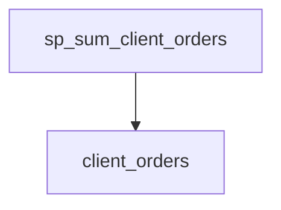
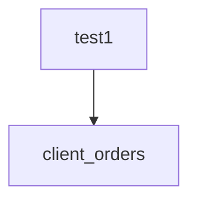
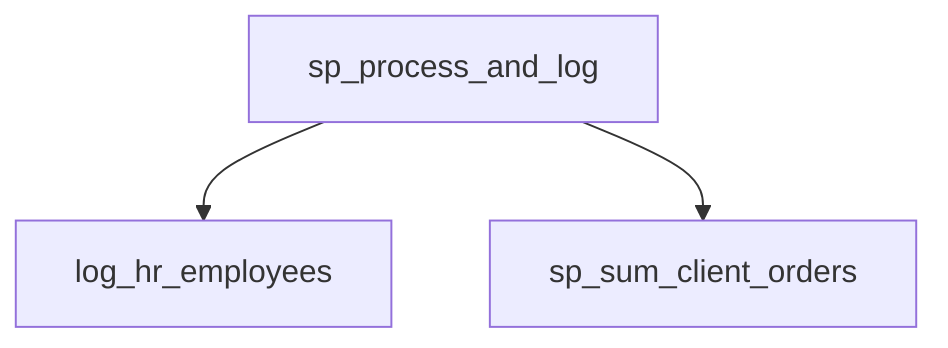

# Summary

<<<<<<< HEAD
- **Total Procedures**: 1
- **Total Tables**: 3
- **Most Called Procedure**: `N/A`
=======
- **Total Procedures**: 5
- **Total Tables**: 5
- **Most Called Procedure**: `log_hr_employees`
>>>>>>> main

---

# Table of Contents

<<<<<<< HEAD
- [AcmeERP.usp_ProcessFullPayrollCycle](#acmeerpusp_processfullpayrollcycle)
=======
- [log_hr_employees](#log_hr_employees)
- [sp_sum_client_orders](#sp_sum_client_orders)
- [test1](#test1)
- [sp_update_inventory](#sp_update_inventory)
- [sp_process_and_log](#sp_process_and_log)
>>>>>>> main

---

## Stored Procedure: AcmeERP.usp_ProcessFullPayrollCycle
<a name="acmeerpusp_processfullpayrollcycle"></a>

---

### Parameters

| Name | Type |
|------|------|
| @PayPeriodStart | DATE |
| @PayPeriodEnd | DATE |

---

### Tables

- AcmeERP.PayrollLogs
- AcmeERP.ExchangeRates
- #PayrollCalc

---

### Called Procedures


---

### Call Graph

```mermaid
graph TD
<<<<<<< HEAD
    AcmeERP.usp_ProcessFullPayrollCycle --> AcmeERP.PayrollLogs
    AcmeERP.usp_ProcessFullPayrollCycle --> AcmeERP.ExchangeRates
    AcmeERP.usp_ProcessFullPayrollCycle --> #PayrollCalc
=======
    log_hr_employees --> employee_log
    log_hr_employees --> employees
```

---

### Business Logic

The stored procedure `log_hr_employees` automatically records all HR department employees into the `employee_log` table.  It iterates through the `employees` table, selecting only those employees belonging to the 'HR' department. For each identified HR employee, it inserts a new log entry into `employee_log`, including the employee's ID, name, and the current timestamp. This provides an audit trail of all HR employees, useful for tracking personnel, reporting, or security purposes.  The procedure uses a cursor, which while functional, is less efficient than set-based operations and should be considered for optimization in high-volume environments.

---


## Stored Procedure: sp_sum_client_orders
<a name="sp_sum_client_orders"></a>

---

### Parameters

| Name | Type |
|------|------|
| @client_id | INTEGER |
| @from_date | DATE |
| @to_date | DATE |

---

### Tables

- client_orders

---

### Called Procedures


---

### Call Graph



---

### Business Logic

The stored procedure `sp_sum_client_orders` calculates the total revenue for a specified client within a given date range, applying a 5% discount to orders exceeding $750.  It iterates through the client's orders, summing the discounted value of those exceeding the threshold to arrive at a final discounted grand total.  The procedure uses a cursor to process each order individually; this approach, while functional, can be inefficient for large datasets.

---


## Stored Procedure: test1
<a name="test1"></a>

---

### Parameters

| Name | Type |
|------|------|
| @client_id | INTEGER |
| @from_date | DATE |
| @to_date | DATE |

---

### Tables

- client_orders

---

### Called Procedures


---

### Call Graph



---

### Business Logic

Procedure `test1` calculates the total revenue for a given client (`@@client_id`) within a specified date range (`@@from_date` to `@@to_date`).  It iterates through the client's orders in the `client_orders` table.  For orders exceeding 750, a 5% discount is applied before accumulating the total revenue (`@grand_total`).  Orders less than or equal to 750 are added to the total without discount.  The procedure ultimately returns the final discounted revenue for the specified client and time period.

---


## Stored Procedure: sp_update_inventory
<a name="sp_update_inventory"></a>

---

### Parameters

| Name | Type |
|------|------|

---

### Tables

- inventory
- products

---

### Called Procedures


---

### Call Graph

```mermaid
graph TD
    sp_update_inventory --> inventory
    sp_update_inventory --> products
>>>>>>> main
```

---

### Business Logic

The stored procedure `sp_update_inventory` automatically flags products requiring restocking.  It iterates through each active product (discontinued = 0) in the `products` table, summing its current inventory quantity from the `inventory` table. If the total quantity for a product falls below 10 units, the procedure updates the `restock` flag in the `products` table to 1, indicating a need for replenishment.  This streamlines the inventory management process by proactively identifying low-stock items.

---


## Stored Procedure: sp_process_and_log
<a name="sp_process_and_log"></a>

---

### Parameters

| Name | Type |
|------|------|
| @client_id | INTEGER |
| @from_date | DATE |
| @to_date | DATE |

---

### Tables


---

### Called Procedures

- log_hr_employees
- sp_sum_client_orders

---

### Call Graph



---

### Business Logic

The stored procedure `sp_process_and_log` performs two distinct business functions. First, it calculates the sum of orders for a specified client within a given date range by calling the `sp_sum_client_orders` procedure.  Second, regardless of the client or date range provided, it logs all HR employees by executing the `log_hr_employees` procedure.  The procedure's overall purpose is to provide both client-specific order aggregation and a consistent HR employee log, potentially for reporting or auditing purposes.  The seemingly unrelated logging action suggests a design that may benefit from refactoring to separate these distinct business processes into individual procedures.

---

