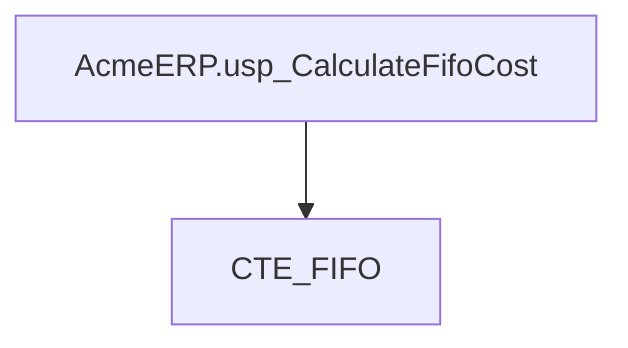
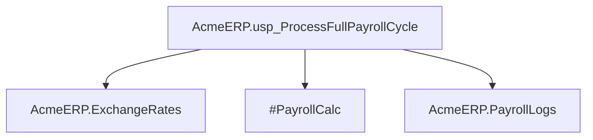
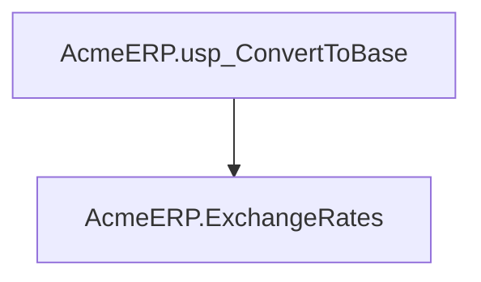
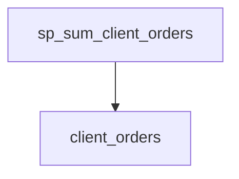
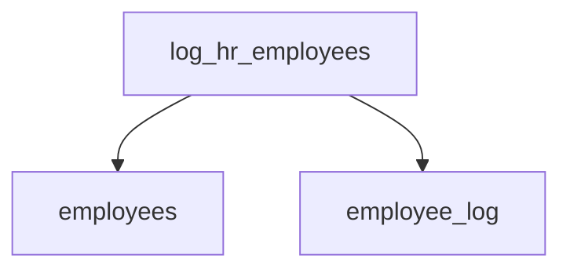
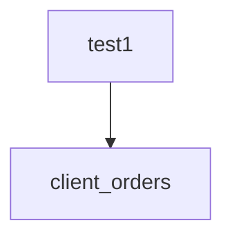
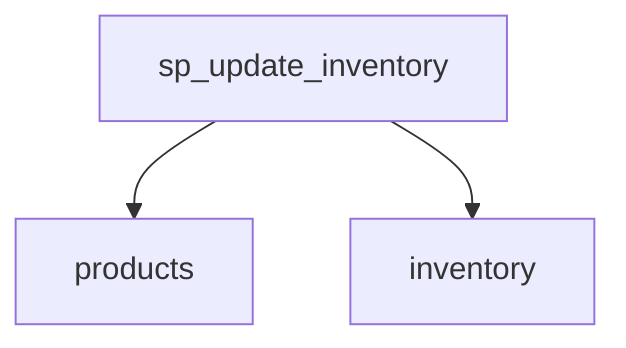

# Summary

- **Total Procedures**: 7
- **Total Tables**: 9
- **Most Called Procedure**: `N/A`

---

# Table of Contents

- [AcmeERP.usp_CalculateFifoCost](#acmeerpusp_calculatefifocost)
- [AcmeERP.usp_ProcessFullPayrollCycle](#acmeerpusp_processfullpayrollcycle)
- [AcmeERP.usp_ConvertToBase](#acmeerpusp_converttobase)
- [sp_sum_client_orders](#sp_sum_client_orders)
- [log_hr_employees](#log_hr_employees)
- [test1](#test1)
- [sp_update_inventory](#sp_update_inventory)

---

## Stored Procedure: AcmeERP.usp_CalculateFifoCost

---

### Parameters

| Name | Type |
|------|------|
| @ProductID | INTEGER |
| @QuantityRequested | INTEGER |

---

### Tables

- CTE_FIFO

---

### Called Procedures

---

### Call Graph

---

### Business Logic

The `AcmeERP.usp_CalculateFifoCost` stored procedure calculates the cost of goods sold (COGS) for a given product using the First-In, First-Out (FIFO) inventory valuation method.  It takes the product ID (`@@ProductID`) and the quantity requested (`@@QuantityRequested`) as input.  The procedure likely iterates through a common table expression (CTE) named `CTE_FIFO`, which presumably contains inventory transaction details (date, quantity, cost), to determine the cost of the requested quantity based on the FIFO principle – assigning costs from the oldest inventory items first.  The procedure's output (not shown in the provided code) is expected to be the total cost of the `@@QuantityRequested` units of the specified `@@ProductID`, calculated according to the FIFO method.

---

## Stored Procedure: AcmeERP.usp_ProcessFullPayrollCycle

---

### Parameters

| Name | Type |
|------|------|
| @PayPeriodStart | DATE |
| @PayPeriodEnd | DATE |

---

### Tables

- AcmeERP.ExchangeRates
- #PayrollCalc
- AcmeERP.PayrollLogs

---

### Called Procedures

---

### Call Graph

---

### Business Logic

The `AcmeERP.usp_ProcessFullPayrollCycle` stored procedure automates the complete payroll processing for a given pay period, defined by the `@@PayPeriodStart` and `@@PayPeriodEnd` parameters.  It utilizes exchange rate data from `AcmeERP.ExchangeRates` to calculate payroll amounts, likely for employees with international compensation.  Intermediate calculations are stored in the temporary table `#PayrollCalc`, and a comprehensive audit trail of the payroll cycle is logged in `AcmeERP.PayrollLogs`.  The procedure's purpose is to accurately and efficiently generate payroll for a specified period, ensuring compliance with currency exchange requirements and providing a detailed record of the process for auditing and reporting.

---

## Stored Procedure: AcmeERP.usp_ConvertToBase

---

### Parameters

| Name | Type |
|------|------|
| @CurrencyCode | CHAR |
| @Amount | NUMERIC |
| @ConversionDate | DATE |

---

### Tables

- AcmeERP.ExchangeRates

---

### Called Procedures

---

### Call Graph

---

### Business Logic

The AcmeERP.usp_ConvertToBase stored procedure converts a monetary amount from a specified currency into the base currency of the Acme ERP system.  It uses the `AcmeERP.ExchangeRates` table to retrieve the appropriate exchange rate based on the provided `@@CurrencyCode` and `@@ConversionDate`. The procedure takes the original amount (`@@Amount`) and applies the retrieved exchange rate to calculate and return the equivalent value in the base currency.  This functionality is crucial for accurate financial reporting and analysis across different currencies within the Acme ERP system.

---

## Stored Procedure: sp_sum_client_orders

---

### Parameters

| Name | Type |
|------|------|
| @client_id | INTEGER |
| @from_date | DATE |
| @to_date | DATE |

---

### Tables

- client_orders

---

### Called Procedures

---

### Call Graph

---

### Business Logic

Procedure `sp_sum_client_orders` calculates the total value of orders for a specified client within a given date range, applying a 5% discount to orders exceeding $750.  It iterates through each order for the client within the specified timeframe; if an order's total price surpasses $750, its discounted value (95% of the total) is added to the running total.  The final result represents the total revenue accrued from the client's orders during the period, adjusted for applicable discounts.

---

## Stored Procedure: log_hr_employees

---

### Parameters

| Name | Type |
|------|------|

---

### Tables

- employees
- employee_log

---

### Called Procedures

---

### Call Graph

---

### Business Logic

The stored procedure `log_hr_employees` automatically logs all employees from the Human Resources (HR) department into the `employee_log` table.  For each HR employee, it records their ID and name along with the current timestamp. This process facilitates auditing and tracking of HR personnel, potentially for security, reporting, or other internal management purposes.  The procedure iterates through all HR employees in the `employees` table, ensuring a complete log of all current HR staff members.

---

## Stored Procedure: test1

---

### Parameters

| Name | Type |
|------|------|
| @client_id | INTEGER |
| @from_date | DATE |
| @to_date | DATE |

---

### Tables

- client_orders

---

### Called Procedures

---

### Call Graph

---

### Business Logic

The `test1` stored procedure calculates the total revenue for a specified client (`@@client_id`) within a given date range (`@@from_date` to `@@to_date`).  It iterates through each order in the `client_orders` table matching these criteria.  For orders exceeding 750 currency units, a 5% discount is applied before accumulating the total revenue (`@grand_total`).  The final output, `@grand_total`, represents the client's total revenue after applying potential discounts.

---

## Stored Procedure: sp_update_inventory

---

### Parameters

| Name | Type |
|------|------|

---

### Tables

- products
- inventory

---

### Called Procedures

---

### Call Graph

---

### Business Logic

The stored procedure `sp_update_inventory` automatically flags products requiring restocking.  It iterates through each active product (discontinued = 0) in the `products` table, summing its current inventory quantity from the `inventory` table. If the total quantity for a product falls below 10 units, the procedure updates the `products` table, setting the `restock` flag to 1 for that product, signaling the need for replenishment.

---

