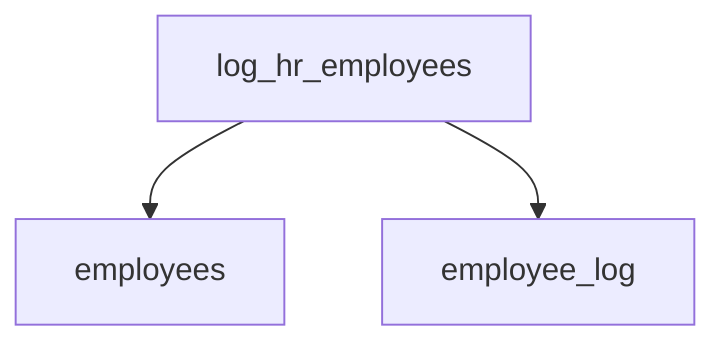

# Summary

- **Total Procedures**: 1
- **Total Tables**: 2
- **Most Called Procedure**: `N/A`

---

# Table of Contents

- [log_hr_employees](#log_hr_employees)

---

## Stored Procedure: log_hr_employees

---

### Parameters

| Name | Type |
|------|------|

---

### Tables

- employees
- employee_log

---

### Called Procedures

---

### Call Graph

---

### Business Logic

The stored procedure `log_hr_employees` automatically logs all employees from the Human Resources (HR) department into the `employee_log` table.  For each HR employee, it records their employee ID and name along with the current timestamp. This process facilitates tracking and auditing of HR personnel, potentially for security, reporting, or other HR-related management needs.  The procedure iterates through all HR employees using a cursor, inserting a log entry for each.

---

