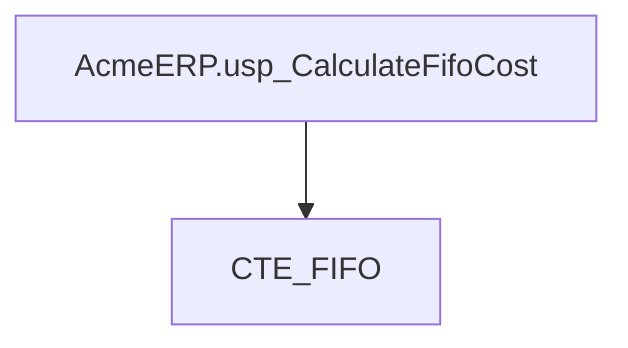
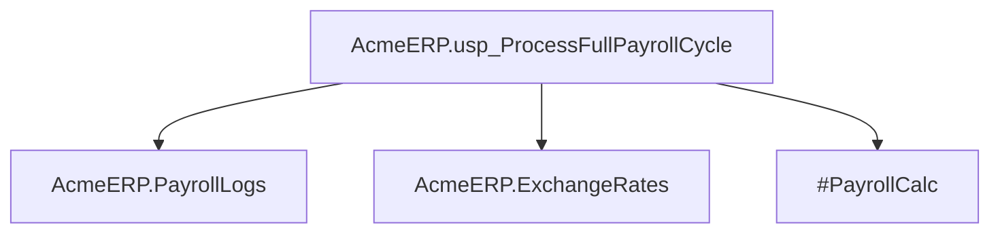
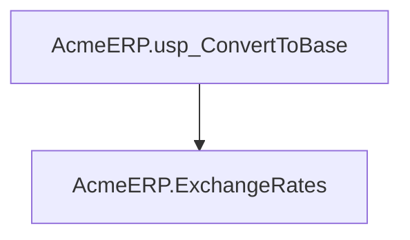

# Summary

- **Total Procedures**: 3
- **Total Tables**: 4
- **Most Called Procedure**: `N/A`

---

# Table of Contents

- [AcmeERP.usp_CalculateFifoCost](#acmeerpusp_calculatefifocost)
- [AcmeERP.usp_ProcessFullPayrollCycle](#acmeerpusp_processfullpayrollcycle)
- [AcmeERP.usp_ConvertToBase](#acmeerpusp_converttobase)

---

## Stored Procedure: AcmeERP.usp_CalculateFifoCost

---

### Parameters

| Name | Type |
|------|------|
| @ProductID | INTEGER |
| @QuantityRequested | INTEGER |

---

### Tables

- CTE_FIFO

---

### Called Procedures

---

### Call Graph

---

### Business Logic

The AcmeERP.usp_CalculateFifoCost stored procedure determines the cost of goods sold (COGS) for a given product using the First-In, First-Out (FIFO) inventory costing method.  It takes the product ID (@@ProductID) and the quantity requested (@@QuantityRequested) as input, and uses a common table expression (CTE) named CTE_FIFO presumably containing inventory data with cost information to calculate the total cost of the requested quantity based on the FIFO principle.  The procedure implicitly returns the calculated cost; the exact mechanism for returning this value (e.g., output parameter, `SELECT` statement) is not specified in the provided code.

---

## Stored Procedure: AcmeERP.usp_ProcessFullPayrollCycle

---

### Parameters

| Name | Type |
|------|------|
| @PayPeriodStart | DATE |
| @PayPeriodEnd | DATE |

---

### Tables

- AcmeERP.PayrollLogs
- AcmeERP.ExchangeRates
- #PayrollCalc

---

### Called Procedures

---

### Call Graph

---

### Business Logic

The `AcmeERP.usp_ProcessFullPayrollCycle` stored procedure calculates and logs the complete payroll for a specified pay period, defined by the `@@PayPeriodStart` and `@@PayPeriodEnd` parameters.  It uses data from the `AcmeERP.PayrollLogs` table (presumably containing employee payroll history) and `AcmeERP.ExchangeRates` (for currency conversions if applicable) to perform the calculations.  Results are temporarily stored in the `#PayrollCalc` temporary table before final processing and logging, implying a multi-step calculation process that likely includes deductions, tax calculations, and currency conversions.  The procedure ultimately updates or inserts payroll data, completing the full payroll cycle for the given period.

---

## Stored Procedure: AcmeERP.usp_ConvertToBase

---

### Parameters

| Name | Type |
|------|------|
| @CurrencyCode | CHAR |
| @Amount | NUMERIC |
| @ConversionDate | DATE |

---

### Tables

- AcmeERP.ExchangeRates

---

### Called Procedures

---

### Call Graph

---

### Business Logic

The `AcmeERP.usp_ConvertToBase` stored procedure converts a given monetary amount from a specified currency into the base currency of the Acme ERP system.  It uses the `AcmeERP.ExchangeRates` table to retrieve the appropriate exchange rate based on the provided currency code and conversion date.  The procedure returns the equivalent amount in the base currency, facilitating accurate financial reporting and calculations across different currencies within the Acme ERP system.

---

