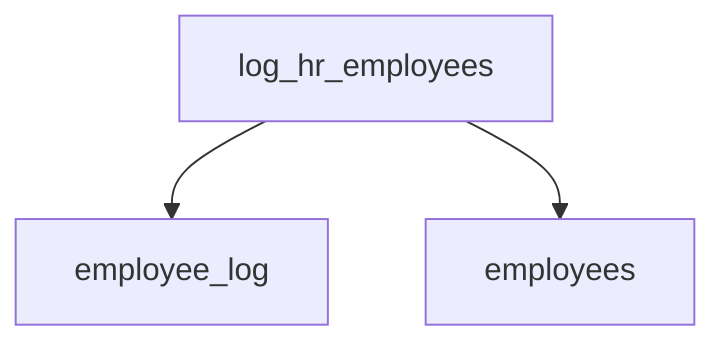
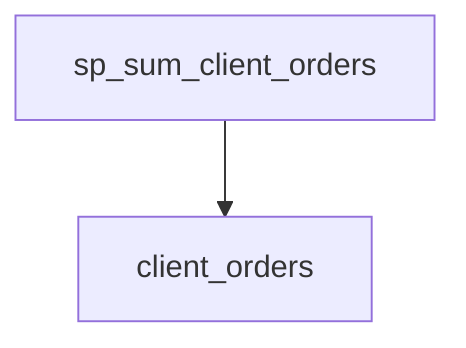
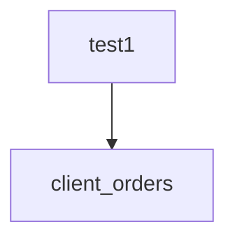
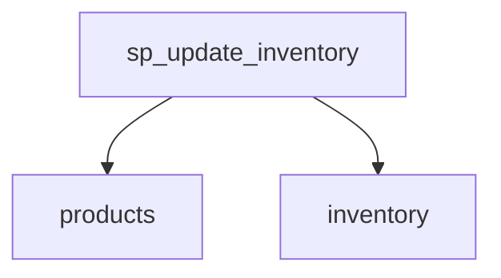

# Summary

- **Total Procedures**: 4
- **Total Tables**: 5
- **Most Called Procedure**: `N/A`

---

# Table of Contents

- [log_hr_employees](#log_hr_employees)
- [sp_sum_client_orders](#sp_sum_client_orders)
- [test1](#test1)
- [sp_update_inventory](#sp_update_inventory)

---

## Stored Procedure: log_hr_employees

---

### Parameters

| Name | Type |
|------|------|

---

### Tables

- employee_log
- employees

---

### Called Procedures

---

### Call Graph

---

### Business Logic

No description provided.

---

## Stored Procedure: sp_sum_client_orders

---

### Parameters

| Name | Type |
|------|------|
| @client_id | INTEGER |
| @from_date | DATE |
| @to_date | DATE |

---

### Tables

- client_orders

---

### Called Procedures

---

### Call Graph

---

### Business Logic

No description provided.

---

## Stored Procedure: test1

---

### Parameters

| Name | Type |
|------|------|
| @client_id | INTEGER |
| @from_date | DATE |
| @to_date | DATE |

---

### Tables

- client_orders

---

### Called Procedures

---

### Call Graph

---

### Business Logic

No description provided.

---

## Stored Procedure: sp_update_inventory

---

### Parameters

| Name | Type |
|------|------|

---

### Tables

- products
- inventory

---

### Called Procedures

---

### Call Graph

---

### Business Logic

No description provided.

---

