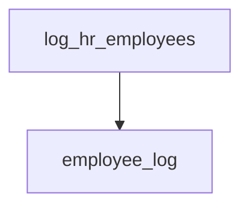
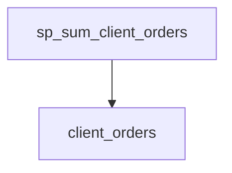
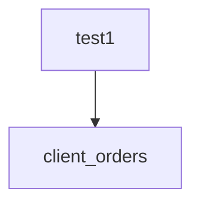
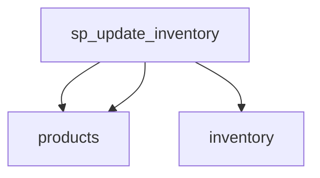
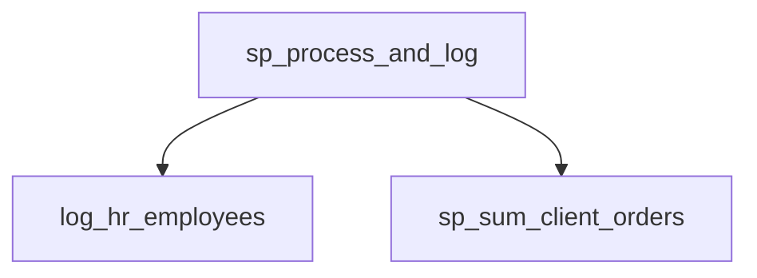

# Summary

<<<<<<< HEAD
- **Total Procedures**: 1
- **Total Tables**: 3
- **Most Called Procedure**: `N/A`
=======
- **Total Procedures**: 5
- **Total Tables**: 5
- **Most Called Procedure**: `log_hr_employees`
>>>>>>> main

---

# Table of Contents

<<<<<<< HEAD
- [AcmeERP.usp_ProcessFullPayrollCycle](#acmeerpusp_processfullpayrollcycle)
=======
- [log_hr_employees](#log_hr_employees)
- [sp_sum_client_orders](#sp_sum_client_orders)
- [test1](#test1)
- [sp_update_inventory](#sp_update_inventory)
- [sp_process_and_log](#sp_process_and_log)
>>>>>>> main

---

## Stored Procedure: AcmeERP.usp_ProcessFullPayrollCycle

---

### Parameters

| Name | Type |
|------|------|
| @PayPeriodStart | DATE |
| @PayPeriodEnd | DATE |

---

### Tables

- AcmeERP.PayrollLogs
- AcmeERP.ExchangeRates
- #PayrollCalc

---

### Called Procedures

---

### Call Graph

---

### Business Logic

This stored procedure automatically logs all HR employees into the `employee_log` table.  It records each employee's ID and name along with the timestamp of the log entry.  This provides an audit trail of HR personnel.

---

## Stored Procedure: sp_sum_client_orders

---

### Parameters

| Name | Type |
|------|------|
| @client_id | INTEGER |
| @from_date | DATE |
| @to_date | DATE |

---

### Tables

- client_orders

---

### Called Procedures

---

### Call Graph

---

### Business Logic

This stored procedure calculates the total value of a client's orders within a specified date range, applying a 5% discount to orders exceeding $750.  It aggregates order totals for a given client ID, considering only orders placed between the provided `from_date` and `to_date`.  The procedure's output (currently incomplete in the provided code) would represent the final discounted sum of qualifying orders.

---

## Stored Procedure: test1

---

### Parameters

| Name | Type |
|------|------|
| @client_id | INTEGER |
| @from_date | DATE |
| @to_date | DATE |

---

### Tables

- client_orders

---

### Called Procedures

---

### Call Graph

---

### Business Logic

The `test1` procedure calculates the total revenue for a given client within a specified date range.  Orders exceeding 750 receive a 5% discount before being included in the total. The procedure iterates through the client's orders to compute this discounted revenue.

---

## Stored Procedure: sp_update_inventory

---

### Parameters

| Name | Type |
|------|------|

---

### Tables

- products
- inventory

---

### Called Procedures

---

### Call Graph

---

### Business Logic

This stored procedure identifies products that are not discontinued and have low inventory levels.  It reviews inventory quantities for each product and flags those with less than 10 units remaining as requiring restocking.

---

## Stored Procedure: sp_process_and_log

---

### Parameters

| Name | Type |
|------|------|
| @client_id | INTEGER |
| @from_date | DATE |
| @to_date | DATE |

---

### Tables

---

### Called Procedures

- log_hr_employees
- sp_sum_client_orders

---

### Call Graph

---

### Business Logic

This stored procedure processes client order data and generates an HR employee log.  It calculates a sum of orders for a specified client within a given date range and then logs all HR employees, regardless of the client or date parameters.  The procedure's output consists of the order summation and an HR employee log;  it doesn't directly return values.

---

