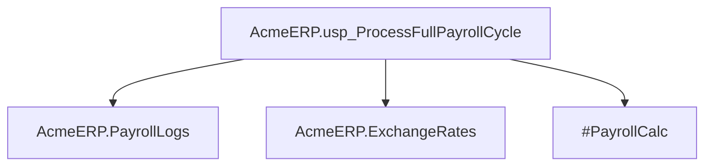

# Summary

- **Total Procedures**: 1
- **Total Tables**: 3
- **Most Called Procedure**: `N/A`

---

# Table of Contents

- [AcmeERP.usp_ProcessFullPayrollCycle](#acmeerpusp_processfullpayrollcycle)

---

## Stored Procedure: AcmeERP.usp_ProcessFullPayrollCycle

---

### Parameters

| Name | Type |
|------|------|
| @PayPeriodStart | DATE |
| @PayPeriodEnd | DATE |

---

### Tables

- AcmeERP.PayrollLogs
- AcmeERP.ExchangeRates
- #PayrollCalc

---

### Called Procedures

---

### Call Graph

---

### Business Logic

No description provided.

---

