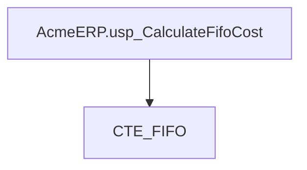
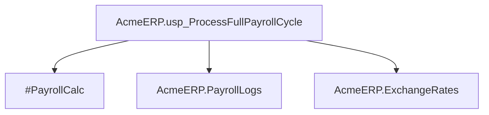
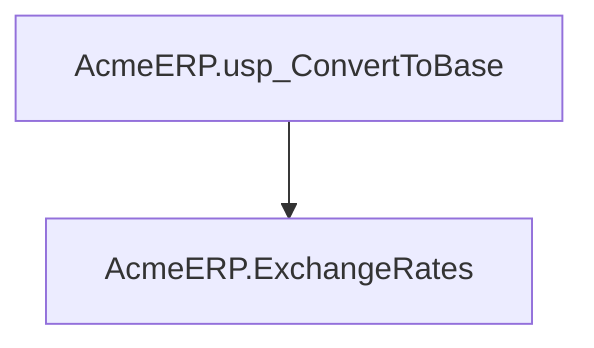
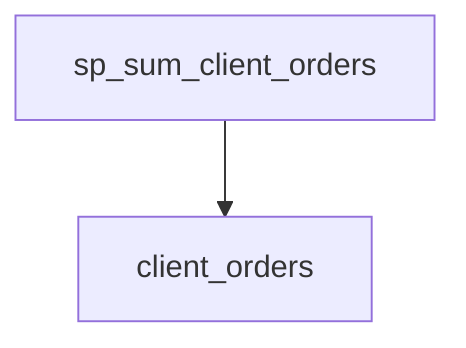
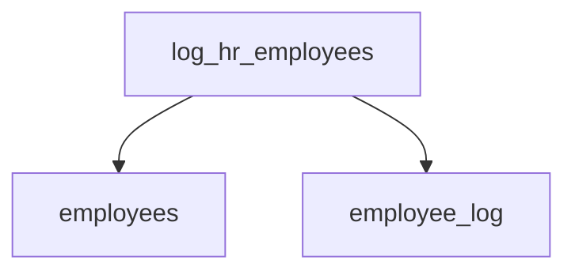
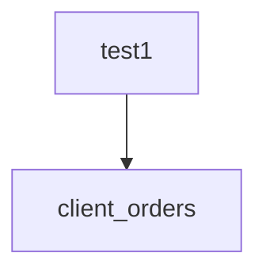
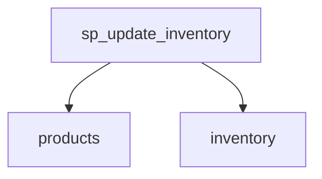

# Summary

- **Total Procedures**: 7
- **Total Tables**: 9
- **Most Called Procedure**: `N/A`

---

# Table of Contents

- [AcmeERP.usp_CalculateFifoCost](#acmeerpusp_calculatefifocost)
- [AcmeERP.usp_ProcessFullPayrollCycle](#acmeerpusp_processfullpayrollcycle)
- [AcmeERP.usp_ConvertToBase](#acmeerpusp_converttobase)
- [sp_sum_client_orders](#sp_sum_client_orders)
- [log_hr_employees](#log_hr_employees)
- [test1](#test1)
- [sp_update_inventory](#sp_update_inventory)

---

## Stored Procedure: AcmeERP.usp_CalculateFifoCost

---

### Parameters

| Name | Type |
|------|------|
| @ProductID | INTEGER |
| @QuantityRequested | INTEGER |

---

### Tables

- CTE_FIFO

---

### Called Procedures

---

### Call Graph

---

### Business Logic

The `AcmeERP.usp_CalculateFifoCost` procedure is designed to calculate the cost of a specified quantity of a product using the First-In-First-Out (FIFO) inventory valuation method. By accepting a `ProductID` and `QuantityRequested` as inputs, the procedure determines the cost by sequentially processing inventory transactions in chronological order, applying the cost of the oldest inventory first until the requested quantity is fully accounted for. The logic leverages a Common Table Expression (CTE_FIFO) to systematically track and aggregate these costs, ensuring accurate financial reporting in compliance with FIFO accounting principles. This procedure supports inventory management by providing precise costing data for order fulfillment, financial statements, or inventory valuation purposes.

---

## Stored Procedure: AcmeERP.usp_ProcessFullPayrollCycle

---

### Parameters

| Name | Type |
|------|------|
| @PayPeriodStart | DATE |
| @PayPeriodEnd | DATE |

---

### Tables

- #PayrollCalc
- AcmeERP.PayrollLogs
- AcmeERP.ExchangeRates

---

### Called Procedures

---

### Call Graph

---

### Business Logic

Without the actual SQL source code provided, I can't offer a precise business logic description. However, based on the given context (procedure name, parameters, and tables involved), I can infer a general description:

"AcmeERP.usp_ProcessFullPayrollCycle is a stored procedure designed to execute a complete payroll processing cycle for a specified pay period. It takes a start and end date as parameters to define the payroll period. The procedure likely calculates employee compensations, applies tax and benefit deductions, and may handle currency conversions using exchange rates. It records these calculations in an intermediate table (#PayrollCalc) and logs the processing activities in AcmeERP.PayrollLogs. The final results are presumably used to generate payroll disbursements and updates to financial records."

To provide a more accurate description, the actual SQL code would be necessary to understand the specific business rules and data manipulations being performed.

---

## Stored Procedure: AcmeERP.usp_ConvertToBase

---

### Parameters

| Name | Type |
|------|------|
| @CurrencyCode | CHAR |
| @Amount | NUMERIC |
| @ConversionDate | DATE |

---

### Tables

- AcmeERP.ExchangeRates

---

### Called Procedures

---

### Call Graph

---

### Business Logic

The `AcmeERP.usp_ConvertToBase` stored procedure is designed to convert a monetary amount from a given currency to the base currency used by the AcmeERP system. By accepting a currency code (`@@CurrencyCode`), the amount to be converted (`@@Amount`), and the conversion date (`@@ConversionDate`), the procedure queries the `AcmeERP.ExchangeRates` table to retrieve the applicable exchange rate for the specified date. It then applies this rate to the input amount to compute the equivalent value in the base currency, ensuring accurate financial calculations for reporting, accounting, or transaction processing within the enterprise resource planning (ERP) system. This functionality is critical for multinational operations, enabling consistent and standardized financial reporting across different currencies.

---

## Stored Procedure: sp_sum_client_orders

---

### Parameters

| Name | Type |
|------|------|
| @client_id | INTEGER |
| @from_date | DATE |
| @to_date | DATE |

---

### Tables

- client_orders

---

### Called Procedures

---

### Call Graph

---

### Business Logic

The `sp_sum_client_orders` procedure calculates a discounted grand total of orders placed by a specific client within a specified date range. It retrieves each order's total price from the `client_orders` table for the given client ID and date range, then applies a 5% discount to orders exceeding 750 currency units. The procedure iterates through each qualifying order, summing these discounted amounts to compute the grand total, which essentially provides a business view of the client's cumulative spending with applied loyalty or bulk discounts during the selected period.

---

## Stored Procedure: log_hr_employees

---

### Parameters

| Name | Type |
|------|------|

---

### Tables

- employees
- employee_log

---

### Called Procedures

---

### Call Graph

---

### Business Logic

The `log_hr_employees` stored procedure is designed to track and log all Human Resources (HR) department employees by recording their details in an audit log. The procedure retrieves each HR employee's ID and name from the `employees` table, then inserts this information along with the current timestamp into the `employee_log` table. This creates a time-stamped record of every HR employee, which can be used for monitoring, compliance, or reporting purposes. The process ensures that the HR workforce is consistently documented, providing visibility into personnel changes or maintenance activities over time.

---

## Stored Procedure: test1

---

### Parameters

| Name | Type |
|------|------|
| @client_id | INTEGER |
| @from_date | DATE |
| @to_date | DATE |

---

### Tables

- client_orders

---

### Called Procedures

---

### Call Graph

---

### Business Logic

This SQL procedure, `test1`, calculates the total spending for a specific client over a specified date range, applying a 5% discount to individual orders that exceed $750. It takes three parameters: a client identifier, a starting date, and an ending date. The procedure iterates through all orders placed by the specified client within the given date range, summing their values while applying the discount to qualifying orders. This enables the business to analyze a client's total expenditure with preferential pricing for larger transactions, likely for reporting or customer relationship management purposes. The result, `@grand_total`, represents the client's adjusted total spending after discounts, providing insights into their purchasing behavior and potential loyalty rewards.

---

## Stored Procedure: sp_update_inventory

---

### Parameters

| Name | Type |
|------|------|

---

### Tables

- products
- inventory

---

### Called Procedures

---

### Call Graph

---

### Business Logic

The `sp_update_inventory` procedure monitors active product inventory levels to identify items requiring restocking. It iterates through all non-discontinued products, calculates the total quantity available in inventory for each, and flags products with stock levels below 10 units by setting their `restock` status to 1. This automated check ensures timely replenishment of low-stock items, helping maintain product availability and prevent stockouts while focusing only on active (non-discontinued) products. The procedure serves as an inventory management tool to support efficient supply chain operations.

---

