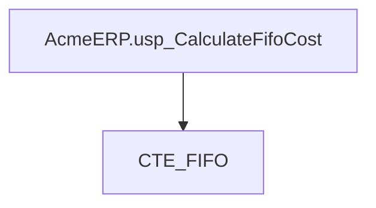
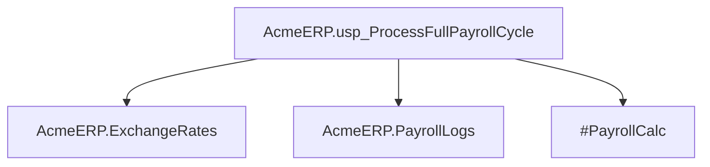
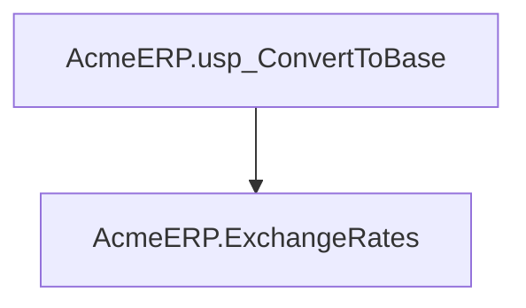
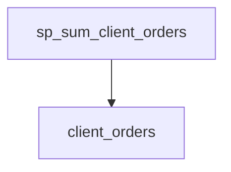
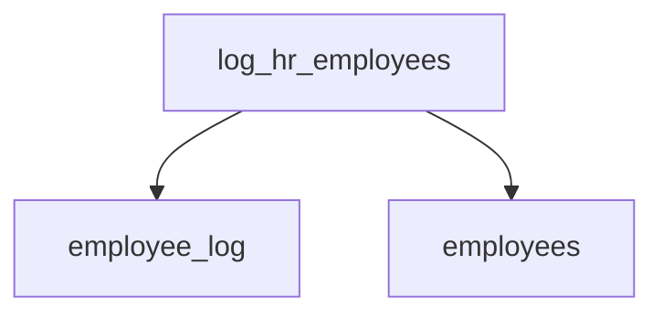
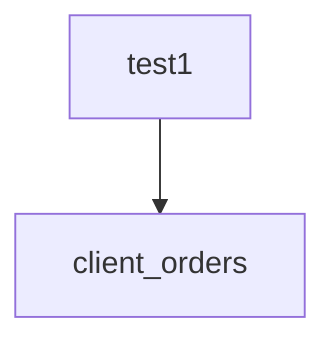
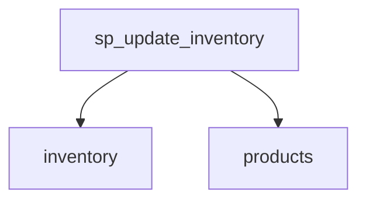

# Summary

- **Total Procedures**: 7
- **Total Tables**: 9
- **Most Called Procedure**: `N/A`

---

# Table of Contents

- [AcmeERP.usp_CalculateFifoCost](#acmeerpusp_calculatefifocost)
- [AcmeERP.usp_ProcessFullPayrollCycle](#acmeerpusp_processfullpayrollcycle)
- [AcmeERP.usp_ConvertToBase](#acmeerpusp_converttobase)
- [sp_sum_client_orders](#sp_sum_client_orders)
- [log_hr_employees](#log_hr_employees)
- [test1](#test1)
- [sp_update_inventory](#sp_update_inventory)

---

## Stored Procedure: AcmeERP.usp_CalculateFifoCost

---

### Parameters

| Name | Type |
|------|------|
| @ProductID | INTEGER |
| @QuantityRequested | INTEGER |

---

### Tables

- CTE_FIFO

---

### Called Procedures

---

### Call Graph

---

### Business Logic

The `AcmeERP.usp_CalculateFifoCost` stored procedure calculates the cost of goods sold (COGS) for a given product using the First-In, First-Out (FIFO) inventory costing method.  It accepts the product ID (`@@ProductID`) and the quantity requested (`@@QuantityRequested`) as input.  The procedure leverages a Common Table Expression (CTE) named `CTE_FIFO`, presumably containing inventory transaction data, to determine the cost of the requested quantity based on the FIFO principle:  the oldest inventory items are assumed to be sold first.  The procedure implicitly returns the calculated FIFO cost, though the exact return mechanism (e.g., output parameter, return value, modification of a table) is not specified in the provided code snippet.

---

## Stored Procedure: AcmeERP.usp_ProcessFullPayrollCycle

---

### Parameters

| Name | Type |
|------|------|
| @PayPeriodStart | DATE |
| @PayPeriodEnd | DATE |

---

### Tables

- AcmeERP.ExchangeRates
- AcmeERP.PayrollLogs
- #PayrollCalc

---

### Called Procedures

---

### Call Graph

---

### Business Logic

The AcmeERP.usp_ProcessFullPayrollCycle stored procedure calculates and processes the complete payroll for a given pay period, defined by the `@@PayPeriodStart` and `@@PayPeriodEnd` parameters.  It uses exchange rate data from the `AcmeERP.ExchangeRates` table to ensure accurate calculations for employees with international compensation.  The procedure logs all payroll processing activities in the `AcmeERP.PayrollLogs` table and utilizes a temporary table, `#PayrollCalc`, for intermediate calculations during the payroll processing. The final output isn't explicitly defined but is implied to update payroll-related tables (not explicitly listed) reflecting the calculated compensation for the specified period.

---

## Stored Procedure: AcmeERP.usp_ConvertToBase

---

### Parameters

| Name | Type |
|------|------|
| @CurrencyCode | CHAR |
| @Amount | NUMERIC |
| @ConversionDate | DATE |

---

### Tables

- AcmeERP.ExchangeRates

---

### Called Procedures

---

### Call Graph

---

### Business Logic

The `AcmeERP.usp_ConvertToBase` stored procedure converts a given monetary amount from a specified currency into the base currency of the Acme ERP system.  It uses the `AcmeERP.ExchangeRates` table to retrieve the appropriate exchange rate for the provided currency code and conversion date.  The procedure then performs the currency conversion calculation and returns the equivalent amount in the base currency.  The absence of provided SQL code prevents further detail on error handling or specific conversion algorithms.

---

## Stored Procedure: sp_sum_client_orders

---

### Parameters

| Name | Type |
|------|------|
| @client_id | INTEGER |
| @from_date | DATE |
| @to_date | DATE |

---

### Tables

- client_orders

---

### Called Procedures

---

### Call Graph

---

### Business Logic

The stored procedure `sp_sum_client_orders` calculates the total sum of client orders for a specified client within a given date range, applying a 5% discount to orders exceeding $750.  It iterates through each order for the designated client, placed between the `@from_date` and `@to_date` parameters, accumulating the total.  Orders over $750 are discounted before being added to the grand total, effectively reflecting a bulk order discount program for high-value client purchases.  The procedure returns the final discounted sum of all qualifying orders.

---

## Stored Procedure: log_hr_employees

---

### Parameters

| Name | Type |
|------|------|

---

### Tables

- employee_log
- employees

---

### Called Procedures

---

### Call Graph

---

### Business Logic

The stored procedure `log_hr_employees` automatically records all HR employees' IDs and names into the `employee_log` table, timestamping each entry with the current date and time.  This procedure iterates through the `employees` table, selecting only those employees belonging to the 'HR' department, and appends their data to the log, providing an audit trail of HR personnel.  The absence of input parameters implies that this is a scheduled or automatically triggered process designed to maintain a continuously updated record of active HR employees.

---

## Stored Procedure: test1

---

### Parameters

| Name | Type |
|------|------|
| @client_id | INTEGER |
| @from_date | DATE |
| @to_date | DATE |

---

### Tables

- client_orders

---

### Called Procedures

---

### Call Graph

---

### Business Logic

Procedure `test1` calculates the total revenue for a given client (`@@client_id`) within a specified date range (`@@from_date`, `@@to_date`).  It iterates through each order in the `client_orders` table matching these criteria.  For orders exceeding 750 currency units, a 5% discount is applied before accumulating the order total into the `@grand_total`.  The final `@grand_total` represents the client's total revenue after applying any applicable discounts.

---

## Stored Procedure: sp_update_inventory

---

### Parameters

| Name | Type |
|------|------|

---

### Tables

- inventory
- products

---

### Called Procedures

---

### Call Graph

---

### Business Logic

The stored procedure `sp_update_inventory` automatically flags products requiring restocking.  It iterates through each active product (discontinued = 0) in the `products` table, summing its current inventory quantity from the `inventory` table. If the total quantity for a product falls below 10 units, the procedure sets the `restock` flag to 1 in the `products` table, indicating a need for replenishment.  This facilitates proactive inventory management by automatically identifying low-stock items.

---

