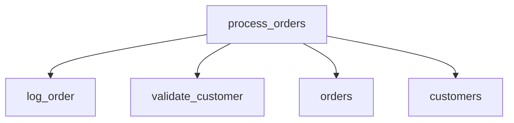
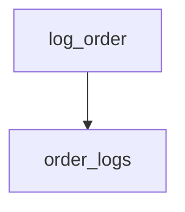

## Summary

**Total Procedures**: 2  
**Total Tables**: 3  
**Most Called Procedure**: `log_order`

---

## Table of Contents

- [process_orders](#stored-procedure-process_orders)
- [log_order](#stored-procedure-log_order)

---

# Stored Procedure:
**process_orders**

---

## Parameters

| Name | Type |
|------|------|
| order_id | INT |
| customer_id | VARCHAR |

---

## Tables

- orders
- customers

---

## Called Procedures

- log_order
- validate_customer

---

## Call Graph

---

## Business Logic

No description provided.

---

# Stored Procedure:
**log_order**

---

## Parameters

| Name | Type |
|------|------|
| order_id | INT |

---

## Tables

- order_logs

---

## Called Procedures

---

## Call Graph

---

## Business Logic

No description provided.

---

