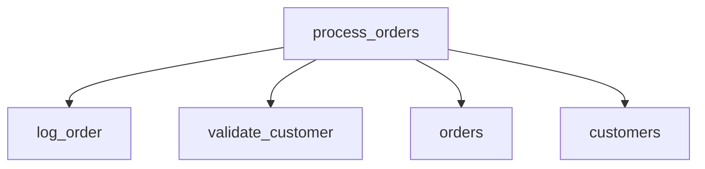
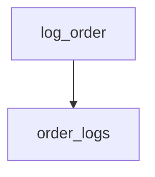
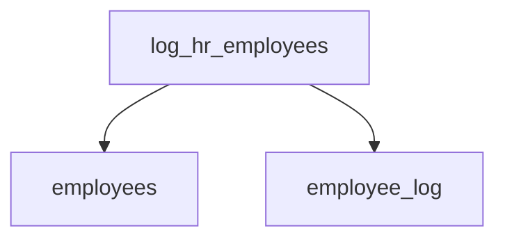

# Summary

- **Total Procedures**: 3
- **Total Tables**: 5
- **Most Called Procedure**: `log_order`

---

# Table of Contents

- [process_orders](#process_orders)
- [log_order](#log_order)
- [log_hr_employees](#log_hr_employees)

---

## Stored Procedure: process_orders

---

### Parameters

| Name | Type |
|------|------|
| order_id | INT |
| customer_id | VARCHAR |

---

### Tables

- orders
- customers

---

### Called Procedures

- log_order
- validate_customer

---

### Call Graph

---

### Business Logic

No description provided.

---

## Stored Procedure: log_order

---

### Parameters

| Name | Type |
|------|------|
| order_id | INT |

---

### Tables

- order_logs

---

### Called Procedures

---

### Call Graph

---

### Business Logic

No description provided.

---

## Stored Procedure: log_hr_employees

---

### Parameters

| Name | Type |
|------|------|

---

### Tables

- employees
- employee_log

---

### Called Procedures

---

### Call Graph

---

### Business Logic

No description provided.

---

